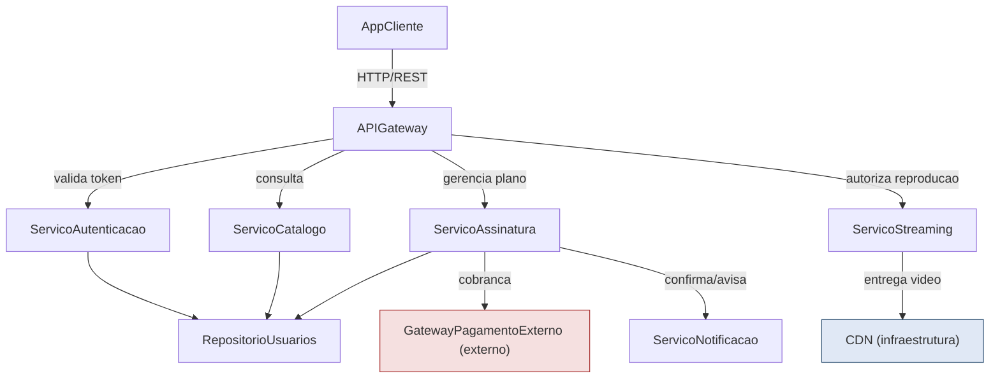
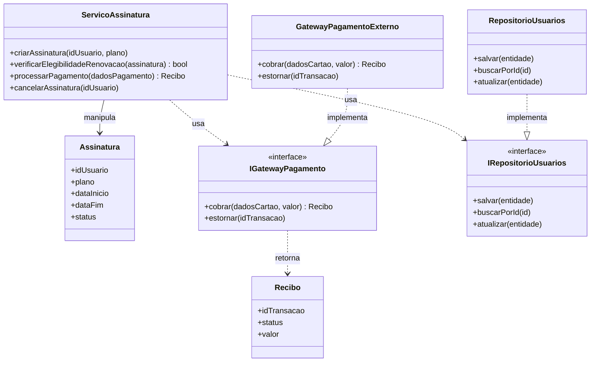
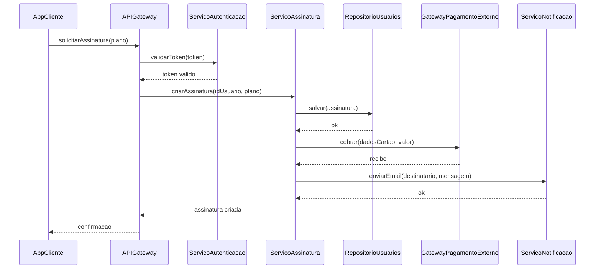
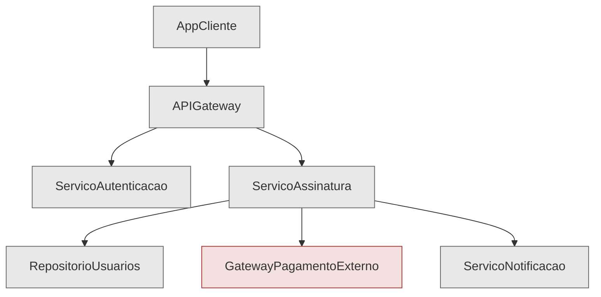
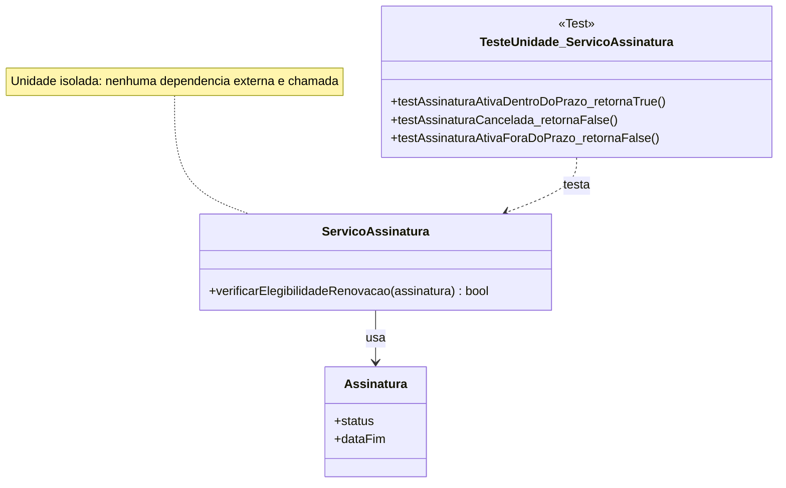

# Arquitetura Base — Sistema StreamPlay

Fonte de verdade para o Laboratório 02.

## 1. Visão Geral

O sistema StreamPlay é uma plataforma de streaming de vídeo sob demanda, estruturada em camadas de apresentação, integração, domínio e infraestrutura. A arquitetura foi modelada para separar responsabilidades, facilitar a evolução do sistema e permitir testes em diferentes níveis.

A solução principal é composta por:

- cliente de acesso;
- gateway de entrada;
- serviços de autenticação, catálogo, assinatura e streaming;
- repositórios persistentes;
- integrações com pagamentos e notificações;
- infraestrutura de entrega de conteúdo via CDN.

---

## 2. Componentes do Sistema

### 2.1 AppCliente

Responsabilidade:
- Interface do usuário para web ou mobile.
- Exibição do catálogo de títulos.
- Reprodução de vídeos.
- Fluxo de autenticação e contratação de planos.

Operações principais:
- login()
- navegarCatalogo()
- solicitarReproducao(idTitulo)
- solicitarAssinatura(plano)

Dependências:
- APIGateway

Interfaces relevantes:
- IAPIGatewayClient (HTTP/REST)

Sistemas externos:
- nenhum diretamente

Infraestrutura:
- nenhuma diretamente

### 2.2 APIGateway

Responsabilidade:
- Ponto único de entrada do sistema.
- Encaminha requisições para os serviços apropriados.
- Valida token de sessão antes de repassar a chamada.

Operações principais:
- rotearRequisicao(req)
- validarToken(token)

Dependências:
- ServicoAutenticacao
- ServicoCatalogo
- ServicoAssinatura
- ServicoStreaming

Interfaces relevantes:
- IAutenticacao
- ICatalogo
- IAssinatura
- IStreaming

Sistemas externos:
- nenhum diretamente

Infraestrutura:
- nenhuma diretamente

### 2.3 ServicoAutenticacao

Responsabilidade:
- Realiza autenticação do usuário.
- Gera e valida tokens JWT.
- Controla acesso às operações protegidas.

Operações principais:
- autenticar(usuario, senha)
- gerarToken(idUsuario)
- validarToken(token)

Dependências:
- RepositorioUsuarios

Interfaces relevantes:
- IRepositorioUsuarios

Sistemas externos:
- nenhum

Infraestrutura:
- Banco de dados associado ao repositório de usuários

### 2.4 ServicoCatalogo

Responsabilidade:
- Consulta títulos disponíveis.
- Exibe metadados e informações de disponibilidade.
- Permite navegação e busca de conteúdos.

Operações principais:
- listarTitulos(filtro)
- buscarDetalhes(idTitulo)

Dependências:
- RepositorioUsuarios (para dados compartilhados e metadados, simplificado neste contexto como repositório central)

Interfaces relevantes:
- IRepositorioCatalogo

Sistemas externos:
- nenhum

Infraestrutura:
- Banco de dados

### 2.5 ServicoAssinatura

Responsabilidade:
- Gerencia planos, status e elegibilidade de renovação.
- Orquestra cobrança e manutenção do ciclo de assinatura.

Operações principais:
- criarAssinatura(idUsuario, plano)
- verificarElegibilidadeRenovacao(assinatura)
- processarPagamento(dadosPagamento)
- cancelarAssinatura(idUsuario)

Dependências:
- RepositorioUsuarios
- GatewayPagamentoExterno
- ServicoNotificacao

Interfaces relevantes:
- IGatewayPagamento
- IRepositorioUsuarios
- INotificacao

Sistemas externos:
- GatewayPagamentoExterno

Infraestrutura:
- Banco de dados

### 2.6 ServicoStreaming

Responsabilidade:
- Autoriza reprodução de vídeos.
- Intermedia a entrega do conteúdo via CDN.

Operações principais:
- autorizarReproducao(idUsuario, idTitulo)
- obterUrlStreaming(idTitulo)

Dependências:
- ServicoAssinatura para verificar se o usuário está ativo
- CDN

Interfaces relevantes:
- ICDN

Sistemas externos:
- nenhum diretamente

Infraestrutura:
- CDN

### 2.7 RepositorioUsuarios

Responsabilidade:
- Persistência de dados de usuários, planos e metadados de catálogo.
- Centralização das informações transacionais do sistema.

Operações principais:
- salvar(entidade)
- buscarPorId(id)
- atualizar(entidade)

Dependências:
- nenhuma, sendo uma camada mais baixa

Interfaces relevantes:
- IRepositorioUsuarios

Sistemas externos:
- nenhum

Infraestrutura:
- Banco de dados relacional (SGBD)

### 2.8 ServicoNotificacao

Responsabilidade:
- Envia notificações por e-mail e push.
- Comunica confirmação de pagamento, falhas e boas-vindas.

Operações principais:
- enviarEmail(destinatario, mensagem)
- enviarPush(idUsuario, mensagem)

Dependências:
- nenhuma diretamente

Interfaces relevantes:
- INotificacao

Sistemas externos:
- provedor de e-mail ou serviço de mensagens

Infraestrutura:
- fila de mensagens (opcional/simplificada)

### 2.9 GatewayPagamentoExterno

Responsabilidade:
- Processa cobrança por cartão ou pix.
- Simula integração com provedores reais, como Stripe ou PagSeguro.

Operações principais:
- cobrar(dadosCartao, valor)
- estornar(idTransacao)

Dependências:
- nenhuma sob controle do sistema

Interfaces relevantes:
- IGatewayPagamento

Sistemas externos:
- é o próprio sistema externo

Infraestrutura:
- fora do escopo de domínio da aplicação

### 2.10 CDN

Responsabilidade:
- Distribui vídeos com baixa latência para diferentes regiões.
- Garante entrega eficiente do conteúdo de mídia.

Operações principais:
- entregarSegmento(idTitulo, qualidade)

Dependências:
- nenhuma sob controle direto do sistema

Interfaces relevantes:
- ICDN

Sistemas externos:
- serviço gerenciado de distribuição de conteúdo

Infraestrutura:
- infraestrutura de entrega de mídia

---

## 3. Dependências e Relacionamentos

O sistema segue uma dependência funcional em que:

- AppCliente depende de APIGateway;
- APIGateway depende de serviços de negócio;
- ServicoAutenticacao, ServicoCatalogo e ServicoAssinatura dependem do repositório;
- ServicoStreaming depende de assinatura ativa e da CDN;
- ServicoAssinatura depende de pagamento e notificação;
- GatewayPagamentoExterno atua como integração externa;
- CDN atua como infraestrutura de entrega de conteúdo.

Essa organização favorece:

- baixo acoplamento entre módulos;
- substituição de integrações externas;
- isolamento de responsabilidades;
- testes mais focados por camada.

---

## 4. Fluxo Principal do Sistema

1. O usuário acessa a aplicação.
2. O cliente envia uma requisição para o APIGateway.
3. O gateway valida o token do usuário.
4. O sistema encaminha a operação para o serviço correspondente.
5. O serviço consulta ou persiste dados em repositórios.
6. Em caso de assinatura ou reprodução, o fluxo pode invocar integrações externas.
7. O cliente recebe a resposta processada e exibe a informação na interface.

---

## 5. Observações de Arquitetura

- A arquitetura foi abstraída para fins didáticos e de laboratório.
- A divisão por serviços facilita a implementação de testes unitários, de integração e de sistema.
- O modelo prioriza clareza conceitual em vez de complexidade operacional real.
- O componente RepositorioUsuarios foi simplificado para representar a persistência central de dados do domínio.

---

## 6. Conclusão

O StreamPlay, em sua arquitetura base, demonstra um padrão de organização em camadas e serviços com responsabilidades bem definidas. Essa estrutura permite evoluir a aplicação com menor risco, manter clareza de manutenção e apoiar testes em diferentes níveis de qualidade e maturidade do software.

## 1. Teste de Unidade

### 1. Contexto do Cenário

No StreamPlay, antes de processar a cobrança de renovação de uma assinatura, o sistema precisa decidir se o usuário está elegível para renovação automática. Essa é uma regra de negócio pura — não depende de rede, banco de dados ou serviços externos — sendo, portanto, uma excelente candidata a teste de unidade.

### 2. Componente/Classe sob Teste

`ServicoAssinatura`

### 3. Método Específico Testado

`verificarElegibilidadeRenovacao(assinatura: Assinatura): bool`

Regra de negócio: a assinatura é elegível para renovação automática se, e somente se, (a) o status atual for `"ativa"` e (b) a data atual estiver dentro de até 3 dias da `dataFim`.

### 4. Pré-condições

- Um objeto `Assinatura` válido é fornecido em memória (sem acesso a banco de dados).
- Nenhuma dependência externa (`RepositorioUsuarios`, `GatewayPagamentoExterno`, `ServicoNotificacao`) é chamada por este método.

### 5. Entradas

Objetos `Assinatura` com diferentes combinações de `status` e `dataFim`.

### 6. Resultado Esperado

`true` quando status = `"ativa"` e `dataFim` está a até 3 dias da data atual; `false` caso contrário.

### 7. Possíveis Defeitos Revelados

- Erro de lógica no cálculo de diferença de datas (off-by-one, ex: usar `<` em vez de `<=`).
- Falha ao verificar o `status` antes da data (ex: aceitar assinatura `"cancelada"` só porque a data bate).
- Erro de fuso horário/timezone na comparação de datas.

## Integração Não Incremental (Big Bang)

### 1. Contexto

Depois de todos os componentes do StreamPlay terem sido desenvolvidos e testados unitariamente de forma isolada (`AppCliente`, `APIGateway`, `ServicoAutenticacao`, `ServicoCatalogo`, `ServicoAssinatura`, `ServicoStreaming`, `RepositorioUsuarios`, `ServicoNotificacao`), a equipe decide integrar todos de uma só vez para o primeiro teste ponta a ponta do fluxo de assinatura, sem nenhuma etapa incremental prévia — típico de um projeto com prazo apertado, onde a equipe optou por acelerar a entrega pulando a integração gradual.

### 2. Componentes Envolvidos

`AppCliente`, `APIGateway`, `ServicoAutenticacao`, `ServicoAssinatura`, `RepositorioUsuarios`, `GatewayPagamentoExterno`, `ServicoNotificacao`.

*(O `ServicoCatalogo`, `ServicoStreaming` e `CDN` não participam deste fluxo específico de assinatura — o cenário foca no caminho crítico de contratação de plano.)*

### 3. Momento da Integração

Todos os sete componentes acima são conectados simultaneamente, em uma única rodada, após terem sido implementados e testados isoladamente. Não há integração parcial anterior (não se integrou primeiro `AppCliente`+`APIGateway`, depois `APIGateway`+`ServicoAutenticacao`, etc.) — tudo entra em produção de teste ao mesmo tempo.

### 5. Problema Típico que Pode Ocorrer

Ao executar o fluxo completo pela primeira vez, o time descobre que `APIGateway` está enviando o campo `idUsuario` como `string`, enquanto `ServicoAssinatura` espera um `int` — um erro de contrato de interface que nenhum teste unitário isolado conseguiria detectar, pois cada componente foi validado com seus próprios mocks internos consistentes com sua própria suposição (equivocada) de tipo.

### 6. Defeitos de Interface ou Integração Encontrados

- Incompatibilidade de tipos de dados entre `APIGateway` e `ServicoAssinatura` (`idUsuario` string vs. int).
- `RepositorioUsuarios` retorna erro de conexão porque o schema de banco usado nos testes unitários de `ServicoAssinatura` era uma versão desatualizada da tabela `assinaturas`.
- `GatewayPagamentoExterno` rejeita a chamada porque `ServicoAssinatura` envia o valor monetário em reais (ex: `29.90`) quando a API externa espera centavos (`2990`).
- `ServicoNotificacao` trava porque `ServicoAssinatura` não envia o campo `destinatario` corretamente preenchido.
- Como tudo falha ao mesmo tempo, é difícil isolar qual das quatro falhas é a causa raiz de cada sintoma observado — todas aparecem misturadas no mesmo log de erro do teste ponta a ponta.

*Todos os componentes aparecem no mesmo nível de cor (cinza), pois nenhum é "isolado" — todos entram juntos na integração. `GatewayPagamentoExterno` é destacado apenas por ser o agente externo (não por status de integração diferenciado).*

### 8. Explicação Textual Correlacionada ao Diagrama

O diagrama de sequência mostra o fluxo completo `AppCliente → APIGateway → ServicoAutenticacao → ServicoAssinatura → RepositorioUsuarios/GatewayPagamentoExterno/ServicoNotificacao` sendo exercitado de ponta a ponta na primeira execução. Diferente de uma estratégia incremental, não há nenhum ponto no diagrama em que um componente é substituído por uma versão simplificada — todas as sete participantes do diagrama de sequência são implementações reais, rodando simultaneamente pela primeira vez. É justamente essa ausência de isolamento gradual que faz com que os quatro defeitos listados no item 6 apareçam todos juntos, tornando o diagnóstico mais custoso: a falha em `RepositorioUsuarios` pode mascarar a falha em `GatewayPagamentoExterno`, por exemplo, já que a execução pode nem chegar a esse ponto do fluxo.

### 9. Vantagens

- Mais rápido de configurar inicialmente — não exige criar nenhum Stub ou Driver.
- Permite observar o comportamento do sistema completo em condições mais próximas do real desde o primeiro teste.
- Reduz o overhead de esforço de setup incremental quando o prazo é curto e os componentes já estão individualmente maduros.

### 10. Desvantagens

- Dificuldade elevada para isolar a causa raiz quando múltiplos defeitos surgem simultaneamente (como demonstrado no item 6).
- Depuração custosa: o time precisou desativar temporariamente `ServicoNotificacao` e `GatewayPagamentoExterno` manualmente, um por um, só para conseguir isolar cada defeito — o oposto do que uma integração incremental já teria proporcionado desde o início.
- Risco alto de atraso no cronograma, pois defeitos de integração aparecem tarde, quando já é mais caro corrigir.
- Nenhuma visibilidade incremental do progresso — o sistema "não funciona" até que absolutamente tudo esteja correto.

### 11. Por que Este Cenário Caracteriza Big Bang e Não Integração Incremental

Este cenário é Big Bang porque:

1. **Não existe nenhuma etapa intermediária de integração parcial** — os sete componentes reais são conectados todos ao mesmo tempo, na primeira tentativa.
2. **Não há uso de Stub ou Driver** — características típicas de integração incremental (Top-Down ou Bottom-Up) para permitir testar um subconjunto da árvore de dependências antes do restante estar pronto. Aqui, propositalmente, não usamos nenhum dos dois, pois o objetivo do cenário é justamente ilustrar a ausência dessa estratégia.
3. **A ordem de integração é irrelevante** — em uma estratégia incremental haveria uma sequência deliberada (ex: primeiro os componentes de camada mais baixa, depois os de cima). Aqui, todos entram juntos, sem sequência lógica de camadas.

- Exceção não tratada quando `dataFim` é nula.

### 9. Explicação Textual Correlacionada ao Diagrama

O diagrama mostra apenas três elementos: a classe de teste (`TesteUnidade_ServicoAssinatura`), a classe sob teste (`ServicoAssinatura`) e o objeto de valor que ela manipula (`Assinatura`). Note que **nenhuma outra classe da arquitetura aparece** — nem `RepositorioUsuarios`, nem `GatewayPagamentoExterno`, nem `ServicoNotificacao`. Isso é proposital e evidencia o isolamento: o método `verificarElegibilidadeRenovacao` não realiza I/O, não chama serviços externos e não depende de infraestrutura, portanto pode (e deve) ser testado sem qualquer Stub, Driver ou Mock. A nota no diagrama reforça essa isolação como característica central do teste de unidade.

### 10. Exemplos de Casos de Teste

| Entrada (`status`, `dataFim` relativa a hoje) | Resultado Esperado | Objetivo |
|---|---|---|
| `status = "ativa"`, `dataFim = hoje + 2 dias` | `true` | Caso dentro da janela de elegibilidade |
| `status = "cancelada"`, `dataFim = hoje + 1 dia` | `false` | Garante que status irregular bloqueia renovação mesmo com data válida |
| `status = "ativa"`, `dataFim = hoje + 10 dias` | `false` | Garante que datas fora da janela de 3 dias não são elegíveis |

---

