# Arquitetura Base — Sistema StreamPlay

Fonte de verdade para o Laboratório 02.

## 1. Visão Geral

O sistema StreamPlay é uma plataforma de streaming de vídeo sob demanda, estruturada em camadas de apresentação, integração, domínio e infraestrutura. A arquitetura foi modelada para separar responsabilidades, facilitar a evolução do sistema e permitir testes em diferentes níveis.

A solução principal é composta por:

- cliente de acesso;
- gateway de entrada;
- serviços de autenticação, catálogo, assinatura e streaming;
- repositórios persistentes;
- integrações com pagamentos e notificações;
- infraestrutura de entrega de conteúdo via CDN.

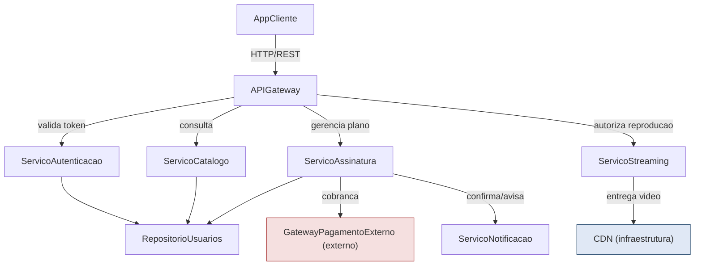

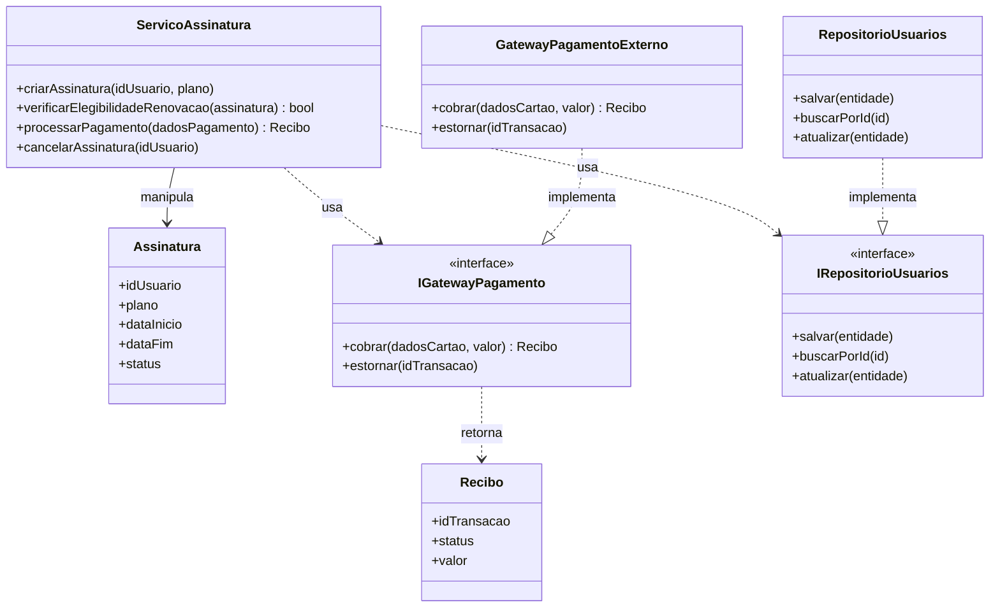

---

## 2. Componentes do Sistema

### 2.1 AppCliente

Responsabilidade:
- Interface do usuário para web ou mobile.
- Exibição do catálogo de títulos.
- Reprodução de vídeos.
- Fluxo de autenticação e contratação de planos.

Operações principais:
- login()
- navegarCatalogo()
- solicitarReproducao(idTitulo)
- solicitarAssinatura(plano)

Dependências:
- APIGateway

Interfaces relevantes:
- IAPIGatewayClient (HTTP/REST)

Sistemas externos:
- nenhum diretamente

Infraestrutura:
- nenhuma diretamente

### 2.2 APIGateway

Responsabilidade:
- Ponto único de entrada do sistema.
- Encaminha requisições para os serviços apropriados.
- Valida token de sessão antes de repassar a chamada.

Operações principais:
- rotearRequisicao(req)
- validarToken(token)

Dependências:
- ServicoAutenticacao
- ServicoCatalogo
- ServicoAssinatura
- ServicoStreaming

Interfaces relevantes:
- IAutenticacao
- ICatalogo
- IAssinatura
- IStreaming

Sistemas externos:
- nenhum diretamente

Infraestrutura:
- nenhuma diretamente

### 2.3 ServicoAutenticacao

Responsabilidade:
- Realiza autenticação do usuário.
- Gera e valida tokens JWT.
- Controla acesso às operações protegidas.

Operações principais:
- autenticar(usuario, senha)
- gerarToken(idUsuario)
- validarToken(token)

Dependências:
- RepositorioUsuarios

Interfaces relevantes:
- IRepositorioUsuarios

Sistemas externos:
- nenhum

Infraestrutura:
- Banco de dados associado ao repositório de usuários

### 2.4 ServicoCatalogo

Responsabilidade:
- Consulta títulos disponíveis.
- Exibe metadados e informações de disponibilidade.
- Permite navegação e busca de conteúdos.

Operações principais:
- listarTitulos(filtro)
- buscarDetalhes(idTitulo)

Dependências:
- RepositorioUsuarios (para dados compartilhados e metadados, simplificado neste contexto como repositório central)

Interfaces relevantes:
- IRepositorioCatalogo

Sistemas externos:
- nenhum

Infraestrutura:
- Banco de dados

### 2.5 ServicoAssinatura

Responsabilidade:
- Gerencia planos, status e elegibilidade de renovação.
- Orquestra cobrança e manutenção do ciclo de assinatura.

Operações principais:
- criarAssinatura(idUsuario, plano)
- verificarElegibilidadeRenovacao(assinatura)
- processarPagamento(dadosPagamento)
- cancelarAssinatura(idUsuario)

Dependências:
- RepositorioUsuarios
- GatewayPagamentoExterno
- ServicoNotificacao

Interfaces relevantes:
- IGatewayPagamento
- IRepositorioUsuarios
- INotificacao

Sistemas externos:
- GatewayPagamentoExterno

Infraestrutura:
- Banco de dados

### 2.6 ServicoStreaming

Responsabilidade:
- Autoriza reprodução de vídeos.
- Intermedia a entrega do conteúdo via CDN.

Operações principais:
- autorizarReproducao(idUsuario, idTitulo)
- obterUrlStreaming(idTitulo)

Dependências:
- ServicoAssinatura para verificar se o usuário está ativo
- CDN

Interfaces relevantes:
- ICDN

Sistemas externos:
- nenhum diretamente

Infraestrutura:
- CDN

### 2.7 RepositorioUsuarios

Responsabilidade:
- Persistência de dados de usuários, planos e metadados de catálogo.
- Centralização das informações transacionais do sistema.

Operações principais:
- salvar(entidade)
- buscarPorId(id)
- atualizar(entidade)

Dependências:
- nenhuma, sendo uma camada mais baixa

Interfaces relevantes:
- IRepositorioUsuarios

Sistemas externos:
- nenhum

Infraestrutura:
- Banco de dados relacional (SGBD)

### 2.8 ServicoNotificacao

Responsabilidade:
- Envia notificações por e-mail e push.
- Comunica confirmação de pagamento, falhas e boas-vindas.

Operações principais:
- enviarEmail(destinatario, mensagem)
- enviarPush(idUsuario, mensagem)

Dependências:
- nenhuma diretamente

Interfaces relevantes:
- INotificacao

Sistemas externos:
- provedor de e-mail ou serviço de mensagens

Infraestrutura:
- fila de mensagens (opcional/simplificada)

### 2.9 GatewayPagamentoExterno

Responsabilidade:
- Processa cobrança por cartão ou pix.
- Simula integração com provedores reais, como Stripe ou PagSeguro.

Operações principais:
- cobrar(dadosCartao, valor)
- estornar(idTransacao)

Dependências:
- nenhuma sob controle do sistema

Interfaces relevantes:
- IGatewayPagamento

Sistemas externos:
- é o próprio sistema externo

Infraestrutura:
- fora do escopo de domínio da aplicação

### 2.10 CDN

Responsabilidade:
- Distribui vídeos com baixa latência para diferentes regiões.
- Garante entrega eficiente do conteúdo de mídia.

Operações principais:
- entregarSegmento(idTitulo, qualidade)

Dependências:
- nenhuma sob controle direto do sistema

Interfaces relevantes:
- ICDN

Sistemas externos:
- serviço gerenciado de distribuição de conteúdo

Infraestrutura:
- infraestrutura de entrega de mídia

---

## 3. Dependências e Relacionamentos

O sistema segue uma dependência funcional em que:

- AppCliente depende de APIGateway;
- APIGateway depende de serviços de negócio;
- ServicoAutenticacao, ServicoCatalogo e ServicoAssinatura dependem do repositório;
- ServicoStreaming depende de assinatura ativa e da CDN;
- ServicoAssinatura depende de pagamento e notificação;
- GatewayPagamentoExterno atua como integração externa;
- CDN atua como infraestrutura de entrega de conteúdo.

Essa organização favorece:

- baixo acoplamento entre módulos;
- substituição de integrações externas;
- isolamento de responsabilidades;
- testes mais focados por camada.

---

## 4. Fluxo Principal do Sistema

1. O usuário acessa a aplicação.
2. O cliente envia uma requisição para o APIGateway.
3. O gateway valida o token do usuário.
4. O sistema encaminha a operação para o serviço correspondente.
5. O serviço consulta ou persiste dados em repositórios.
6. Em caso de assinatura ou reprodução, o fluxo pode invocar integrações externas.
7. O cliente recebe a resposta processada e exibe a informação na interface.

---

## 5. Observações de Arquitetura

- A arquitetura foi abstraída para fins didáticos e de laboratório.
- A divisão por serviços facilita a implementação de testes unitários, de integração e de sistema.
- O modelo prioriza clareza conceitual em vez de complexidade operacional real.
- O componente RepositorioUsuarios foi simplificado para representar a persistência central de dados do domínio.

---

## 6. Conclusão

O StreamPlay, em sua arquitetura base, demonstra um padrão de organização em camadas e serviços com responsabilidades bem definidas. Essa estrutura permite evoluir a aplicação com menor risco, manter clareza de manutenção e apoiar testes em diferentes níveis de qualidade e maturidade do software.

## 1. Teste de Unidade

### 1. Contexto do Cenário

No StreamPlay, antes de processar a cobrança de renovação de uma assinatura, o sistema precisa decidir se o usuário está elegível para renovação automática. Essa é uma regra de negócio pura — não depende de rede, banco de dados ou serviços externos — sendo, portanto, uma excelente candidata a teste de unidade.

### 2. Componente/Classe sob Teste

`ServicoAssinatura`

### 3. Método Específico Testado

`verificarElegibilidadeRenovacao(assinatura: Assinatura): bool`

Regra de negócio: a assinatura é elegível para renovação automática se, e somente se, (a) o status atual for `"ativa"` e (b) a data atual estiver dentro de até 3 dias da `dataFim`.

### 4. Pré-condições

- Um objeto `Assinatura` válido é fornecido em memória (sem acesso a banco de dados).
- Nenhuma dependência externa (`RepositorioUsuarios`, `GatewayPagamentoExterno`, `ServicoNotificacao`) é chamada por este método.

### 5. Entradas

Objetos `Assinatura` com diferentes combinações de `status` e `dataFim`.

### 6. Resultado Esperado

`true` quando status = `"ativa"` e `dataFim` está a até 3 dias da data atual; `false` caso contrário.

### 7. Possíveis Defeitos Revelados

- Erro de lógica no cálculo de diferença de datas (off-by-one, ex: usar `<` em vez de `<=`).
- Falha ao verificar o `status` antes da data (ex: aceitar assinatura `"cancelada"` só porque a data bate).
- Erro de fuso horário/timezone na comparação de datas.

## 2.2 — Integração Incremental Top-Down com Stubs

### Contexto

A equipe começou a integração pela camada superior do sistema. O `ServicoAssinatura` já está implementado e precisa ser integrado com o `APIGateway`, mas sua dependência de nível inferior, o `GatewayPagamentoExterno`, ainda não está disponível — o contrato com o provedor de pagamento externo ainda está em negociação/homologação. Para não bloquear o progresso, a equipe cria um Stub que simula o comportamento do gateway externo.

### 1. Componente de Alto Nível

`ServicoAssinatura` — está sendo testado em integração com o `APIGateway` (que já está pronto e chama `criarAssinatura`).

### 2. Dependência Inferior Ainda Não Disponível

`GatewayPagamentoExterno` — o serviço externo de pagamento ainda não está acessível (ambiente de homologação do provedor fora do ar, ou contrato ainda não assinado).

### 3. Contrato/Interface

`IGatewayPagamento`, com os métodos:

- `cobrar(dadosCartao, valor): Recibo`
- `estornar(idTransacao)`

Esse é exatamente o mesmo contrato definido na arquitetura-base, garantindo que o Stub e o componente real sejam intercambiáveis.

### 4. Componente Stub

`StubGatewayPagamento` — uma implementação falsa de `IGatewayPagamento`, criada exclusivamente para fins de teste.

### 5. Como o Stub Responde

O `StubGatewayPagamento` retorna respostas pré-programadas e fixas, sem processar nenhuma cobrança real:

- Para `cobrar(dadosCartao, valor)`: retorna um `Recibo` fixo (`idTransacao = "TX-STUB-001"`, `status = "aprovado"`) quando o valor é válido (> 0), e lança uma exceção simulada quando o valor é inválido (≤ 0), para permitir testar também o caminho de erro.
- Para `estornar(idTransacao)`: apenas retorna sucesso (`true`), sem lógica real.

### 6. Como a Injeção do Stub Acontece

O `ServicoAssinatura` depende da interface `IGatewayPagamento`, não de uma implementação concreta (princípio de inversão de dependência). Na configuração de testes de integração, o `StubGatewayPagamento` é injetado no construtor (ou setter) de `ServicoAssinatura` no lugar de `GatewayPagamentoExterno`:

```java
ServicoAssinatura servico = new ServicoAssinatura(
    repositorioUsuarios,
    new StubGatewayPagamento(),   // Stub no lugar do componente real
    servicoNotificacao
);
```

### 7. O que Pode Ser Validado Antes da Implementação Real Existir

- Se `ServicoAssinatura` chama `cobrar()` com os parâmetros corretos (valor, dados do cartão) no momento certo do fluxo.
- Se `ServicoAssinatura` trata corretamente a resposta de sucesso (`Recibo` aprovado), avançando para salvar a assinatura e notificar o usuário.
- Se `ServicoAssinatura` trata corretamente uma resposta de falha simulada (ex: valor inválido), interrompendo o fluxo sem salvar assinatura nem enviar notificação de sucesso.
- Se a integração entre `APIGateway` e `ServicoAssinatura` está funcional (contrato de chamada `criarAssinatura`).

### 8. Defeitos que Podem Ser Detectados

- `ServicoAssinatura` não trata exceção lançada pelo Stub, deixando a assinatura em estado inconsistente no `RepositorioUsuarios`.
- `ServicoAssinatura` chama `cobrar()` com o valor no formato errado (ex: reais em vez de centavos), embora o Stub não detecte isso sozinho — mas o teste pode ser desenhado para validar os parâmetros recebidos pelo Stub.
- Falha ao propagar corretamente o `Recibo` retornado pelo Stub para a camada superior (`APIGateway`/`AppCliente`).
- `ServicoAssinatura` não aciona `ServicoNotificacao` após receber confirmação do Stub.

### 9. Quando o Stub Seria Substituído pelo Componente Real

Assim que o `GatewayPagamentoExterno` estiver disponível em ambiente de homologação (contrato assinado, credenciais de sandbox liberadas), o `StubGatewayPagamento` é removido e a mesma injeção de dependência passa a apontar para a implementação real de `IGatewayPagamento`, sem exigir nenhuma alteração no código de `ServicoAssinatura` — apenas na configuração de montagem do objeto.

### Diagrama (Mermaid)

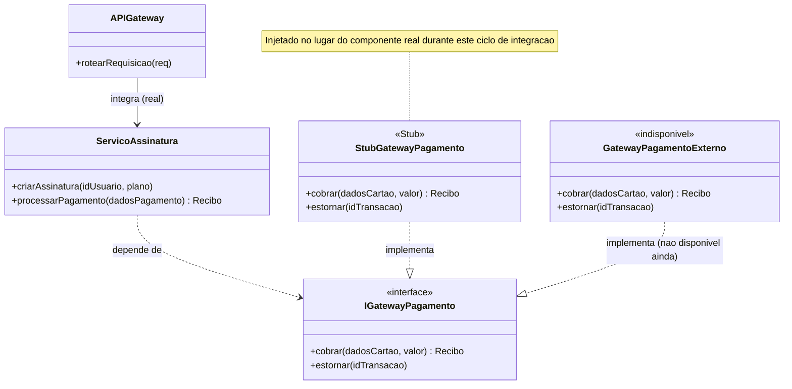

### Explicação Textual Correlacionada ao Diagrama

O diagrama evidencia a estrutura Top-Down: `APIGateway` (camada superior, já real) integra-se com `ServicoAssinatura` (também real), que por sua vez depende da interface `IGatewayPagamento`. Como o `GatewayPagamentoExterno` real está marcado como `<<indisponivel>>`, o `StubGatewayPagamento` — marcado explicitamente com o estereótipo `<<Stub>>` — é quem implementa essa interface durante este ciclo de teste, permitindo que a integração entre as camadas superiores (`APIGateway` → `ServicoAssinatura`) seja validada sem esperar pela dependência inferior.


## Integração Não Incremental (Big Bang)

### 1. Contexto

Depois de todos os componentes do StreamPlay terem sido desenvolvidos e testados unitariamente de forma isolada (`AppCliente`, `APIGateway`, `ServicoAutenticacao`, `ServicoCatalogo`, `ServicoAssinatura`, `ServicoStreaming`, `RepositorioUsuarios`, `ServicoNotificacao`), a equipe decide integrar todos de uma só vez para o primeiro teste ponta a ponta do fluxo de assinatura, sem nenhuma etapa incremental prévia — típico de um projeto com prazo apertado, onde a equipe optou por acelerar a entrega pulando a integração gradual.

### 2. Componentes Envolvidos

`AppCliente`, `APIGateway`, `ServicoAutenticacao`, `ServicoAssinatura`, `RepositorioUsuarios`, `GatewayPagamentoExterno`, `ServicoNotificacao`.

*(O `ServicoCatalogo`, `ServicoStreaming` e `CDN` não participam deste fluxo específico de assinatura — o cenário foca no caminho crítico de contratação de plano.)*

### 3. Momento da Integração

Todos os sete componentes acima são conectados simultaneamente, em uma única rodada, após terem sido implementados e testados isoladamente. Não há integração parcial anterior (não se integrou primeiro `AppCliente`+`APIGateway`, depois `APIGateway`+`ServicoAutenticacao`, etc.) — tudo entra em produção de teste ao mesmo tempo.

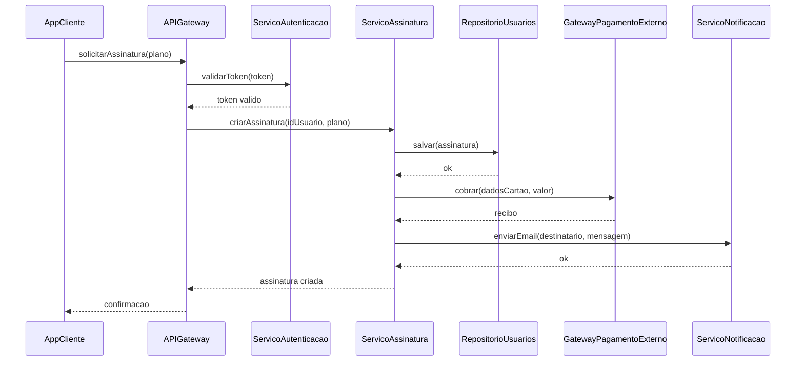

### 5. Problema Típico que Pode Ocorrer

Ao executar o fluxo completo pela primeira vez, o time descobre que `APIGateway` está enviando o campo `idUsuario` como `string`, enquanto `ServicoAssinatura` espera um `int` — um erro de contrato de interface que nenhum teste unitário isolado conseguiria detectar, pois cada componente foi validado com seus próprios mocks internos consistentes com sua própria suposição (equivocada) de tipo.

### 6. Defeitos de Interface ou Integração Encontrados

- Incompatibilidade de tipos de dados entre `APIGateway` e `ServicoAssinatura` (`idUsuario` string vs. int).
- `RepositorioUsuarios` retorna erro de conexão porque o schema de banco usado nos testes unitários de `ServicoAssinatura` era uma versão desatualizada da tabela `assinaturas`.
- `GatewayPagamentoExterno` rejeita a chamada porque `ServicoAssinatura` envia o valor monetário em reais (ex: `29.90`) quando a API externa espera centavos (`2990`).
- `ServicoNotificacao` trava porque `ServicoAssinatura` não envia o campo `destinatario` corretamente preenchido.
- Como tudo falha ao mesmo tempo, é difícil isolar qual das quatro falhas é a causa raiz de cada sintoma observado — todas aparecem misturadas no mesmo log de erro do teste ponta a ponta.

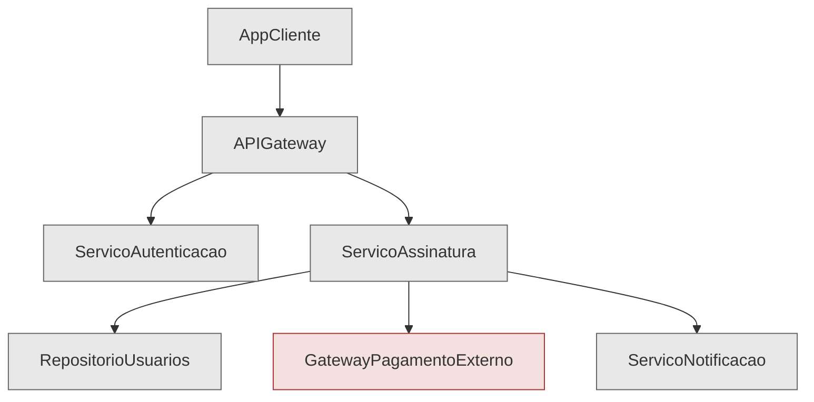

*Todos os componentes aparecem no mesmo nível de cor (cinza), pois nenhum é "isolado" — todos entram juntos na integração. `GatewayPagamentoExterno` é destacado apenas por ser o agente externo (não por status de integração diferenciado).*

### 8. Explicação Textual Correlacionada ao Diagrama

O diagrama de sequência mostra o fluxo completo `AppCliente → APIGateway → ServicoAutenticacao → ServicoAssinatura → RepositorioUsuarios/GatewayPagamentoExterno/ServicoNotificacao` sendo exercitado de ponta a ponta na primeira execução. Diferente de uma estratégia incremental, não há nenhum ponto no diagrama em que um componente é substituído por uma versão simplificada — todas as sete participantes do diagrama de sequência são implementações reais, rodando simultaneamente pela primeira vez. É justamente essa ausência de isolamento gradual que faz com que os quatro defeitos listados no item 6 apareçam todos juntos, tornando o diagnóstico mais custoso: a falha em `RepositorioUsuarios` pode mascarar a falha em `GatewayPagamentoExterno`, por exemplo, já que a execução pode nem chegar a esse ponto do fluxo.

### 9. Vantagens

- Mais rápido de configurar inicialmente — não exige criar nenhum Stub ou Driver.
- Permite observar o comportamento do sistema completo em condições mais próximas do real desde o primeiro teste.
- Reduz o overhead de esforço de setup incremental quando o prazo é curto e os componentes já estão individualmente maduros.

### 10. Desvantagens

- Dificuldade elevada para isolar a causa raiz quando múltiplos defeitos surgem simultaneamente (como demonstrado no item 6).
- Depuração custosa: o time precisou desativar temporariamente `ServicoNotificacao` e `GatewayPagamentoExterno` manualmente, um por um, só para conseguir isolar cada defeito — o oposto do que uma integração incremental já teria proporcionado desde o início.
- Risco alto de atraso no cronograma, pois defeitos de integração aparecem tarde, quando já é mais caro corrigir.
- Nenhuma visibilidade incremental do progresso — o sistema "não funciona" até que absolutamente tudo esteja correto.

### 11. Por que Este Cenário Caracteriza Big Bang e Não Integração Incremental

Este cenário é Big Bang porque:

1. **Não existe nenhuma etapa intermediária de integração parcial** — os sete componentes reais são conectados todos ao mesmo tempo, na primeira tentativa.
2. **Não há uso de Stub ou Driver** — características típicas de integração incremental (Top-Down ou Bottom-Up) para permitir testar um subconjunto da árvore de dependências antes do restante estar pronto. Aqui, propositalmente, não usamos nenhum dos dois, pois o objetivo do cenário é justamente ilustrar a ausência dessa estratégia.
3. **A ordem de integração é irrelevante** — em uma estratégia incremental haveria uma sequência deliberada (ex: primeiro os componentes de camada mais baixa, depois os de cima). Aqui, todos entram juntos, sem sequência lógica de camadas.

- Exceção não tratada quando `dataFim` é nula.

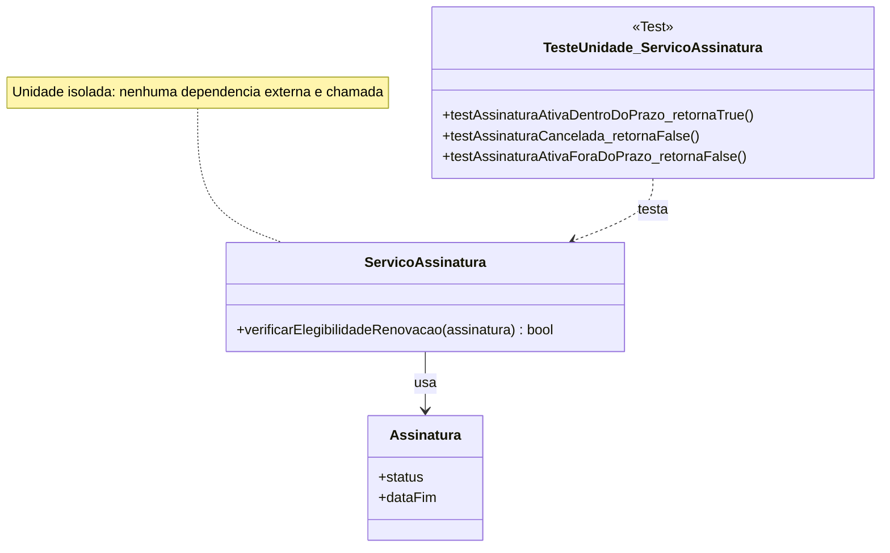

### 9. Explicação Textual Correlacionada ao Diagrama

O diagrama mostra apenas três elementos: a classe de teste (`TesteUnidade_ServicoAssinatura`), a classe sob teste (`ServicoAssinatura`) e o objeto de valor que ela manipula (`Assinatura`). Note que **nenhuma outra classe da arquitetura aparece** — nem `RepositorioUsuarios`, nem `GatewayPagamentoExterno`, nem `ServicoNotificacao`. Isso é proposital e evidencia o isolamento: o método `verificarElegibilidadeRenovacao` não realiza I/O, não chama serviços externos e não depende de infraestrutura, portanto pode (e deve) ser testado sem qualquer Stub, Driver ou Mock. A nota no diagrama reforça essa isolação como característica central do teste de unidade.

### 10. Exemplos de Casos de Teste

| Entrada (`status`, `dataFim` relativa a hoje) | Resultado Esperado | Objetivo |
|---|---|---|
| `status = "ativa"`, `dataFim = hoje + 2 dias` | `true` | Caso dentro da janela de elegibilidade |
| `status = "cancelada"`, `dataFim = hoje + 1 dia` | `false` | Garante que status irregular bloqueia renovação mesmo com data válida |
| `status = "ativa"`, `dataFim = hoje + 10 dias` | `false` | Garante que datas fora da janela de 3 dias não são elegíveis |

---

## 2.3 — Integração Incremental Bottom-Up com Drivers

### Contexto

Nesta etapa, a equipe implementou primeiro os componentes de camada mais baixa: `RepositorioUsuarios` e `ServicoNotificacao`, ambos totalmente funcionais e testados unitariamente. Porém, o componente que os orquestra, `ServicoAssinatura`, ainda está em desenvolvimento (sua lógica de orquestração de assinatura/pagamento ainda não foi finalizada). Para validar se `RepositorioUsuarios` e `ServicoNotificacao` respondem corretamente às chamadas que `ServicoAssinatura` fará no futuro, a equipe cria um Driver de teste.

### Componentes Reais de Baixo Nível (2+)

1. `RepositorioUsuarios` — real, implementado. Interface: `IRepositorioUsuarios` (`salvar(entidade)`, `buscarPorId(id)`, `atualizar(entidade)`).
2. `ServicoNotificacao` — real, implementado. Interface: `INotificacao` (`enviarEmail(destinatario, mensagem)`, `enviarPush(idUsuario, mensagem)`).

### Componente Superior Ausente

`ServicoAssinatura` — ainda não implementado/finalizado. Não existe no ambiente de teste.

### Driver de Teste

`DriverServicoAssinatura` — um componente de teste criado exclusivamente para simular as chamadas que `ServicoAssinatura` faria a `RepositorioUsuarios` e `ServicoNotificacao`.

### Diagrama de Sequência (Mermaid)

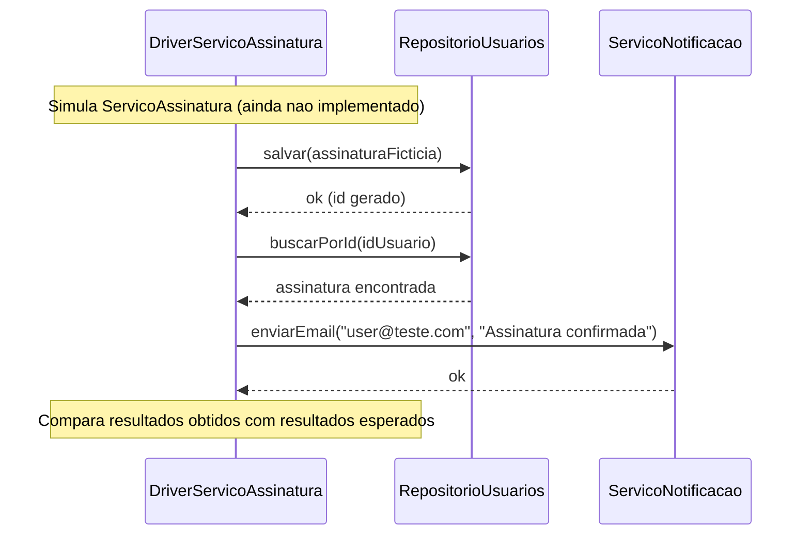

### Diagrama de Componentes (Mermaid)

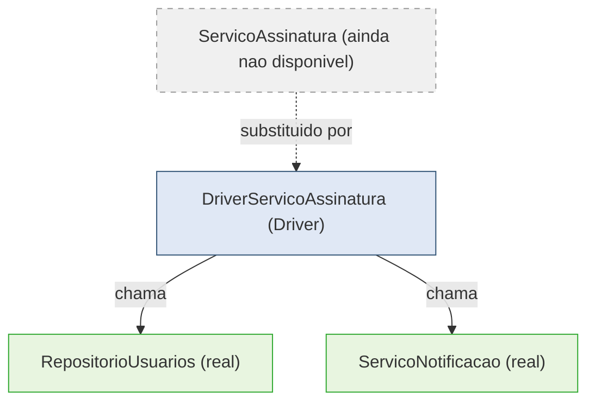

### Explicação Textual Correlacionada ao Diagrama

Nos diagramas, `RepositorioUsuarios` e `ServicoNotificacao` aparecem como componentes reais, já implementados — nenhuma simulação é aplicada a eles. Quem não existe é `ServicoAssinatura`, representado no diagrama de componentes com borda tracejada, indicando ausência. Em seu lugar, o `DriverServicoAssinatura` assume o papel de quem chama os componentes de baixo nível, exatamente como `ServicoAssinatura` faria: primeiro `salvar()` para persistir a assinatura, depois `buscarPorId()` para confirmar a persistência, e por fim `enviarEmail()` para simular a notificação de confirmação. O Driver então compara os resultados retornados por `RepositorioUsuarios` e `ServicoNotificacao` com os valores esperados, validando esses dois componentes antes que o componente superior real exista.

---

### 1. Por Que a Estratégia é Bottom-Up

A integração parte das camadas mais baixas da hierarquia (`RepositorioUsuarios`, `ServicoNotificacao`) — componentes sem dependências de outros módulos internos — subindo progressivamente em direção às camadas superiores. Isso é o oposto do Top-Down (seção 2.2), onde partimos do topo. Aqui, o componente superior (`ServicoAssinatura`) é o que falta, não o inferior.

### 2. Por Que o Driver é Necessário

Sem um chamador, `RepositorioUsuarios` e `ServicoNotificacao` não têm como ser exercitados em um cenário de integração — eles são passivos, apenas respondem a chamadas. Como `ServicoAssinatura` (quem normalmente faria essas chamadas) ainda não existe, é necessário um componente de teste que assuma esse papel de chamador.

### 3. Responsabilidade do Driver

Simular o comportamento de invocação que `ServicoAssinatura` teria: montar os parâmetros de entrada, chamar os métodos de `RepositorioUsuarios` e `ServicoNotificacao` na ordem correta, capturar os resultados retornados e compará-los com os valores esperados (assertions).

### 4. O Que o Driver Chama

- `RepositorioUsuarios.salvar(assinaturaFicticia)`
- `RepositorioUsuarios.buscarPorId(idUsuario)`
- `ServicoNotificacao.enviarEmail(destinatario, mensagem)`

### 5. Defeitos que Podem Ser Identificados

- `RepositorioUsuarios.salvar()` não persiste corretamente todos os campos da entidade `Assinatura` (ex: perde o campo `dataFim`).
- `RepositorioUsuarios.buscarPorId()` retorna dados desatualizados (problema de cache ou transação não commitada).
- `ServicoNotificacao.enviarEmail()` falha silenciosamente sem lançar exceção quando o e-mail é inválido, mascarando um erro que `ServicoAssinatura` precisaria tratar no futuro.
- Incompatibilidade de tipos entre o que o Driver envia e o que os componentes reais esperam (ex: `idUsuario` como `string` vs `int` — mesmo defeito de contrato citado na seção Big Bang, mas aqui detectado antes da integração completa, de forma isolada).

### 6. O Que Aconteceria Quando o Componente Superior Fosse Integrado

Quando `ServicoAssinatura` estiver pronto, o `DriverServicoAssinatura` é removido e `ServicoAssinatura` passa a fazer as mesmas chamadas reais a `RepositorioUsuarios` e `ServicoNotificacao` — que já foram validadas e não devem mais apresentar os defeitos listados no item 5, restando apenas verificar a lógica de orquestração do próprio `ServicoAssinatura` (o que será feito no teste de unidade/integração específico dele).

---

### Comparação Curta: Stub vs. Driver (sem inversão conceitual)

| Aspecto | Stub (seção 2.2) | Driver (esta seção) |
|---|---|---|
| Simula | Uma dependência de nível inferior, ainda não implementada | Um componente chamador de nível superior, ainda não implementado |
| Quem chama quem | O componente real (`ServicoAssinatura`) chama o Stub | O Driver chama os componentes reais (`RepositorioUsuarios`, `ServicoNotificacao`) |
| Direção da integração | Top-Down | Bottom-Up |
| Papel do teste | Passivo (responde) | Ativo (invoca) |

---

## 2.4 — Teste de Fumaça (Smoke Testing)

### Contexto

Uma nova versão do StreamPlay (v2.3.0) acabou de ser implantada no ambiente de homologação, após a integração dos componentes descritas nas seções anteriores. Antes de liberar a versão para a bateria completa de testes funcionais e de regressão, a equipe de QA executa um Smoke Test: um conjunto pequeno de verificações críticas para responder rapidamente à pergunta "essa versão está minimamente estável para continuar recebendo testes, ou está tão quebrada que nem vale a pena prosseguir?"

### Conjunto de Verificações Críticas

| Verificação | Componente(s) envolvido(s) |
|---|---|
| 1. Inicialização da aplicação | `AppCliente`, `APIGateway` |
| 2. Autenticação básica | `AppCliente` → `APIGateway` → `ServicoAutenticacao` |
| 3. Funcionalidade principal (listar catálogo) | `ServicoCatalogo` |
| 4. Acesso ao banco/serviço essencial | `RepositorioUsuarios` |
| 5. Resposta básica do sistema (status HTTP 200) | `APIGateway` |

### Diagrama de Sequência (Mermaid)

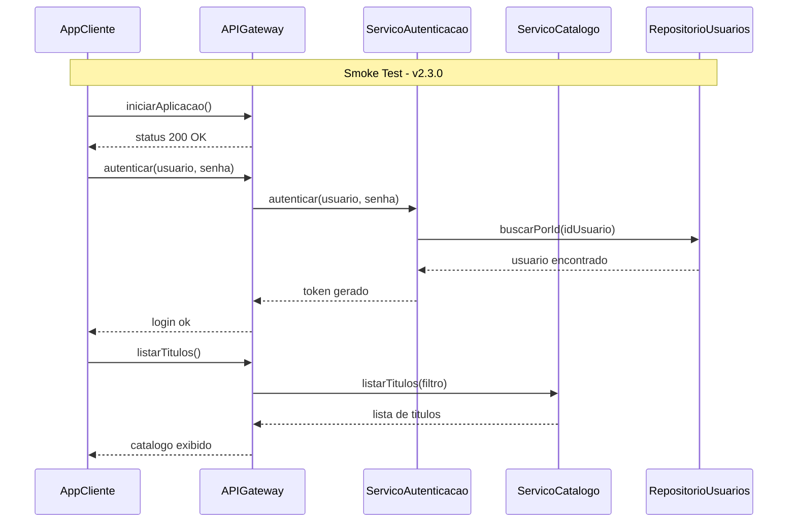

### Explicação Textual Correlacionada ao Diagrama

O diagrama exercita exatamente as cinco verificações críticas em sequência: a aplicação responde (`iniciarAplicacao` → status 200), a autenticação funciona de ponta a ponta passando por `ServicoAutenticacao` e consultando `RepositorioUsuarios`, e a funcionalidade principal (`listarTitulos`, via `ServicoCatalogo`) retorna dados. Nenhuma etapa de pagamento, notificação ou streaming de vídeo é exercitada aqui — propositalmente, pois o Smoke Test deve tocar apenas o caminho mínimo de "o sistema está de pé".

---

### 1. Objetivo do Smoke Test

Confirmar rapidamente que a build recém-implantada não está catastroficamente quebrada, verificando se os fluxos mais básicos e essenciais do sistema funcionam antes de investir tempo em testes mais profundos.

### 2. Por Que é Superficial e Amplo

O Smoke Test é superficial porque cada verificação testa apenas o "caminho feliz" mínimo (ex: login com credenciais válidas, não os múltiplos cenários de erro). É amplo porque cobre vários componentes diferentes (`APIGateway`, `ServicoAutenticacao`, `ServicoCatalogo`, `RepositorioUsuarios`) em vez de se aprofundar em um único módulo — o objetivo é ter uma visão panorâmica da saúde do sistema, não exaustividade.

### 3. O Que Ele Não Pretende Testar

- Não testa múltiplos cenários de erro ou casos de borda (isso é papel do teste de unidade/integração detalhado).
- Não mede tempo de resposta ou comportamento sob carga (isso é Teste de Desempenho/Estresse — seções futuras).
- Não avalia vulnerabilidades ou tentativas de ataque (isso é Teste de Segurança).
- Não compara comportamento com versões anteriores especificamente (isso é Teste de Regressão).
- Não testa o fluxo de pagamento, streaming de vídeo ou notificações — esses são fluxos secundários para efeito do Smoke Test.

### 4. Condição para Aprovar a Versão

Todas as cinco verificações críticas devem ser executadas com sucesso, sem exceções ou erros: aplicação inicia, login funciona, catálogo é listado, banco responde, e o sistema retorna respostas HTTP válidas. Se tudo passa, a build é liberada para a bateria completa de testes funcionais/regressão.

### 5. Condição para Rejeitar a Versão

Se qualquer uma das cinco verificações falhar — por exemplo, `APIGateway` não inicia, ou `ServicoAutenticacao` não consegue validar um login válido, ou `ServicoCatalogo` retorna lista vazia/erro — a build é imediatamente rejeitada e devolvida à equipe de desenvolvimento, sem prosseguir para outras fases de teste.

### 6. Defeitos que Pode Revelar

- Falha de deploy (ex: variável de ambiente ausente impedindo `APIGateway` de subir).
- Erro de configuração de conexão com banco de dados (`RepositorioUsuarios` inacessível).
- Quebra de contrato entre `APIGateway` e `ServicoAutenticacao` após uma atualização recente de versão.
- `ServicoCatalogo` retornando erro 500 por dependência mal configurada.

---

## 2.5 — Teste de Regressão

### 1. Alteração Realizada

Para corrigir um bug relatado em produção — assinaturas expiradas ainda permitindo reprodução de vídeo — a equipe modificou o método `autorizarReproducao(idUsuario, idTitulo)` do `ServicoStreaming`, adicionando uma nova verificação: antes de autorizar a reprodução, o método agora também consulta o `RepositorioUsuarios` para confirmar o campo `status` da assinatura, além da checagem que já existia (validação de token).

### 2. Componente Alterado

`ServicoStreaming`, especificamente o método `autorizarReproducao(idUsuario, idTitulo)`.

### 3. Funcionalidades Potencialmente Afetadas

- Reprodução de vídeo para usuários com assinatura ativa (funcionalidade principal — não deveria mudar, mas pode ser afetada por erro na nova lógica).
- Reprodução de vídeo durante o período de teste gratuito (trial), que pode ter um `status` diferente de `"ativa"` (ex: `"trial"`) e ser bloqueado incorretamente pela nova verificação.
- Fluxo de renovação automática: se a renovação ainda não foi processada no exato instante da checagem, o usuário pode ser bloqueado indevidamente mesmo estando prestes a renovar.
- Testes de Smoke (seção 2.4) que verificam autenticação e catálogo não usam este método diretamente, mas qualquer teste ponta-a-ponta que inclua "assistir vídeo" passa a depender dessa nova checagem.

### 4. Casos de Teste Antigos que Devem Ser Reexecutados

| ID | Caso de teste antigo | Resultado esperado (mantido) |
|---|---|---|
| RT-01 | Usuário com assinatura `"ativa"` solicita reprodução | Reprodução autorizada |
| RT-02 | Usuário sem assinatura solicita reprodução | Reprodução negada |
| RT-03 | Usuário com assinatura `"cancelada"` solicita reprodução | Reprodução negada |
| RT-04 | Usuário com token expirado solicita reprodução | Reprodução negada (por token, não por assinatura) |

### 5. Novo Caso de Teste Relacionado à Alteração

| ID | Caso de teste novo | Resultado esperado |
|---|---|---|
| RT-05 | Usuário com assinatura `"expirada"` (status alterado por vencimento de `dataFim`) solicita reprodução | Reprodução negada — este é o cenário que motivou a correção |

### 6. Possível Regressão

Ao rodar novamente o conjunto de testes antigos, a equipe descobre que **RT-02 e RT-03 continuam passando, mas surge uma regressão inesperada**: usuários em período de teste gratuito (`status = "trial"`), que antes conseguiam assistir normalmente, agora são bloqueados pela nova verificação — porque o desenvolvedor só previu os status `"ativa"` e `"cancelada"`/`"expirada"` na nova lógica, esquecendo do status `"trial"`. Ou seja, a correção do bug relatado introduziu um novo defeito em uma funcionalidade que antes funcionava corretamente.

### 7. Diagrama de Sequência (Mermaid)

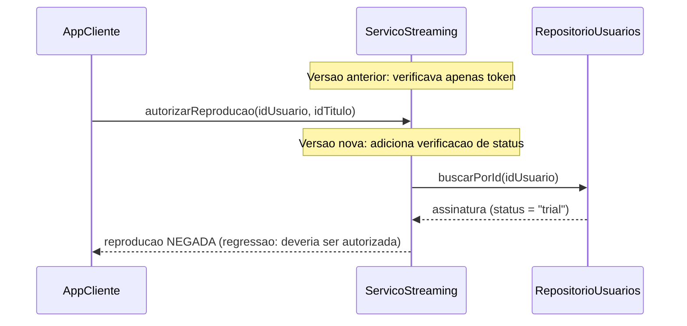

### 8. Explicação Textual

O diagrama contrasta o comportamento "antes da alteração" (nota superior: `ServicoStreaming` verificava apenas o token) com o comportamento "depois da alteração" (nova chamada a `RepositorioUsuarios.buscarPorId`). O caso mostrado usa `status = "trial"`, revelando que a nova lógica em `ServicoStreaming.autorizarReproducao` não contempla esse valor de status, resultando em uma negação indevida — a regressão identificada no item 6.

#### Relação antes / alteração / reexecução

- **Antes da alteração:** `autorizarReproducao` validava apenas o token, sem checar `status` da assinatura (por isso o bug original ocorria).
- **Alteração:** inclusão da chamada a `RepositorioUsuarios.buscarPorId` e verificação condicional do campo `status`.
- **Reexecução dos testes existentes (RT-01 a RT-04):** confirmam que o comportamento para assinaturas `"ativa"`, ausente e `"cancelada"` permanece correto — mas a reexecução de um teste equivalente para `"trial"` (que já deveria fazer parte do conjunto de regressão, mas não estava coberto) expõe a falha introduzida.

### Por Que Este Cenário Caracteriza Regressão (e Não Smoke Testing)

Este é um teste de regressão porque seu propósito é verificar se uma alteração pontual em `ServicoStreaming` quebrou funcionalidades que já funcionavam antes (o caso `"trial"`), reexecutando casos de teste já existentes (RT-01 a RT-04) e comparando com o comportamento anterior conhecido. Isso é fundamentalmente diferente do Smoke Test (seção 2.4), que verifica superficialmente se uma versão nova está "de pé" para novos testes, sem focar em nenhuma alteração específica nem comparar com comportamento anterior — o Smoke Test não teria detectado esse defeito, pois ele não testa o fluxo de reprodução de vídeo em detalhe algum.

---

## 3.1 — Critérios de Aceitação / User Acceptance Testing

### Funcionalidade Escolhida

Contratação de assinatura mensal do StreamPlay pelo usuário final.

### 1. Necessidade do Usuário

Como usuário, quero contratar um plano de assinatura de forma simples e rápida, informando meus dados de pagamento uma única vez, para poder assistir ao catálogo completo de filmes e séries imediatamente após a confirmação.

### 2. Critérios Objetivos de Aceitação

- O usuário deve conseguir escolher um plano e confirmar a assinatura em no máximo 3 etapas (selecionar plano, informar pagamento, confirmar).
- Após confirmação bem-sucedida, o usuário deve receber uma mensagem clara de sucesso e ter acesso liberado ao catálogo em até alguns segundos.
- Caso o pagamento seja recusado, o usuário deve ser informado do motivo de forma compreensível (não apenas um erro técnico genérico).
- O usuário deve receber uma confirmação por e-mail da assinatura realizada.

### 3. Cenários de Sucesso

- **Cenário A:** Usuário autenticado seleciona o plano "Mensal", informa dados de cartão válidos, confirma — assinatura é ativada e catálogo é liberado.
- **Cenário B:** Usuário recebe e-mail de confirmação em até 1 minuto após a contratação.

### 4. Cenários de Falha

- **Cenário C:** Usuário informa dados de cartão inválidos (ex: número incorreto) — sistema informa "Não foi possível processar seu pagamento, verifique os dados do cartão", sem travar ou apresentar erro técnico.
- **Cenário D:** Usuário tenta contratar assinatura sem estar autenticado — sistema redireciona para tela de login antes de prosseguir.

### 5. Resultado Esperado

Para os cenários de sucesso, o usuário deve conseguir assistir a qualquer título do catálogo imediatamente após a confirmação, sem etapas adicionais. Para os cenários de falha, o usuário deve entender claramente o motivo e conseguir tentar novamente sem perder os dados já preenchidos (exceto os dados sensíveis do cartão, por segurança).

### 6. Condição para Aprovação da Funcionalidade

A funcionalidade é aprovada pelo cliente/usuário se todos os cenários de sucesso (A e B) ocorrerem exatamente como descrito, e todos os cenários de falha (C e D) resultarem em mensagens claras e não bloqueantes — sem qualquer necessidade de conhecimento técnico para o usuário entender o que aconteceu.

### Diagrama de Sequência (Mermaid)

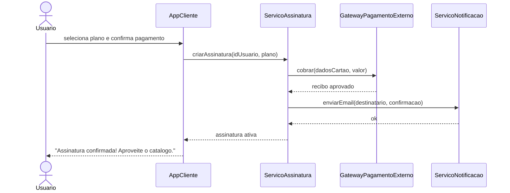

### Explicação — Por Que Este Teste Representa Validação da Necessidade do Usuário

Diferente dos testes anteriores (unidade, integração, regressão), que verificam se os componentes internos — `ServicoAssinatura`, `GatewayPagamentoExterno`, `ServicoNotificacao` — se comunicam corretamente do ponto de vista técnico, o UAT aqui avalia se a experiência completa entregue ao usuário atende à necessidade original: contratar um plano de forma simples e ter acesso imediato ao catálogo. O diagrama de sequência começa e termina no ator `Usuario`, e a validação de sucesso não é "o método retornou o objeto certo", mas sim "o usuário recebeu uma mensagem compreensível e conseguiu assistir ao conteúdo". Os componentes internos aparecem no diagrama apenas como meio para entregar esse resultado, não como o objeto principal da avaliação — quem decide se o teste passou é o critério de negócio definido com o cliente, não uma asserção de código.

---

## 3.2 — Teste Alfa

### Contexto

Antes de disponibilizar o StreamPlay publicamente, a equipe interna da organização (desenvolvedores, QA, product managers e alguns funcionários de outras áreas da empresa) avalia a versão em um ambiente controlado, dentro da própria infraestrutura da empresa, para identificar problemas antes de qualquer exposição a usuários externos.

### Versão Avaliada

StreamPlay v3.0.0-alpha, contendo a nova funcionalidade de assinatura e streaming integradas (conforme desenvolvido nas seções anteriores), ainda não publicada nas lojas de aplicativos nem liberada ao público.

### Participantes

Funcionários internos da organização: equipe de desenvolvimento, QA, product managers e um grupo voluntário de outros departamentos (ex: marketing, suporte) — todos com vínculo direto com a empresa responsável pelo produto.

### Ambiente

Ambiente de staging interno, hospedado na infraestrutura da própria empresa, com dados fictícios/de teste (não produção), acessível apenas via VPN corporativa.

### Funcionalidades Avaliadas

- Fluxo completo de contratação de assinatura (do plano à confirmação).
- Reprodução de vídeo do catálogo.
- Cancelamento de assinatura.
- Navegação geral da interface (`AppCliente`).

### Problemas Procurados

- Falhas de usabilidade (fluxos confusos, botões pouco claros).
- Bugs funcionais não capturados pelos testes automatizados anteriores.
- Inconsistências visuais entre diferentes dispositivos/navegadores.
- Comportamentos inesperados ao combinar ações em sequências não previstas pelos casos de teste formais (ex: cancelar assinatura durante a reprodução de um vídeo).

### Feedback Coletado

Relatórios estruturados dos participantes internos, incluindo: passos para reproduzir problemas encontrados, sugestões de melhoria de usabilidade, e avaliação subjetiva de fluidez da experiência — coletados via formulário interno e sessões de observação direta.

### Critérios para Avançar para a Próxima Etapa (Beta)

- Nenhum defeito crítico ou bloqueante em aberto (ex: impossibilidade de contratar assinatura ou assistir vídeo).
- Ao menos 90% dos participantes internos conseguem completar o fluxo principal (assinar → assistir) sem assistência.
- Feedback de usabilidade incorporado nas correções mais relevantes antes da liberação para o público externo controlado (Beta).

### Diagrama de Sequência (Mermaid)

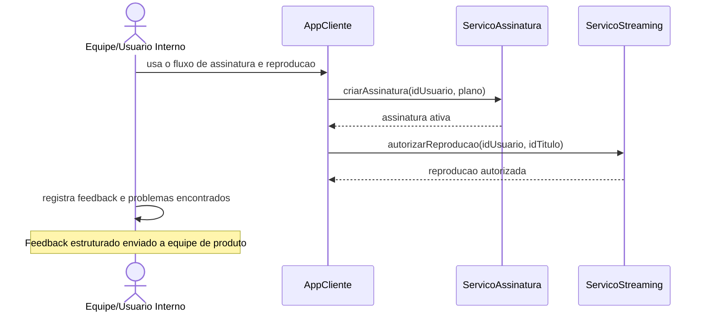

### Explicação Textual Correlacionada ao Diagrama

O diagrama mostra o participante interno interagindo diretamente com o `AppCliente` em sua versão Alfa, exercitando o fluxo real de assinatura e reprodução — os mesmos componentes (`ServicoAssinatura`, `ServicoStreaming`) já validados tecnicamente nas seções anteriores. A diferença central aqui não está na arquitetura, mas em quem realiza o teste e com qual objetivo: o foco não é verificar se o código está correto (isso já foi validado por unidade, integração e regressão), mas sim colher a percepção humana sobre a experiência de uso, em um ambiente ainda fechado à organização.

---

### Diferença Entre Teste Alfa e Teste Beta

| Aspecto | Teste Alfa | Teste Beta |
|---|---|---|
| Quem participa | Equipe interna da organização | Usuários externos reais, fora da empresa |
| Ambiente | Controlado, staging interno | Mais próximo de produção, às vezes produção real limitada |
| Visibilidade | Não pública | Pode ser pública ou semi-pública (grupo seleto de usuários externos) |
| Objetivo | Encontrar problemas antes de qualquer exposição externa | Validar a experiência e estabilidade com usuários reais, em condições mais diversas e imprevisíveis |

### Por Que Este Cenário Não é Unidade, Integração ou Aceitação

- **Não é Unidade:** não avalia um método isolado, mas a experiência de uso de um fluxo completo por pessoas reais.
- **Não é Integração (Big Bang/Top-Down/Bottom-Up):** não há Stub, Driver, nem foco em contratos técnicos entre componentes — os componentes já estão integrados e funcionando; o foco é comportamental/experiencial.
- **Não é UAT/Critérios de Aceitação (seção 3.1):** o UAT é conduzido com base em critérios formais definidos junto ao cliente/stakeholder de negócio para validar requisitos específicos; o Teste Alfa é mais exploratório, conduzido pela própria equipe interna, buscando problemas não previstos, sem um roteiro fixo de critérios de aprovação por requisito.

---

## 3.3 — Teste Beta

### Contexto

Após a aprovação na etapa Alfa (seção 3.2), o StreamPlay v3.0.0-beta é disponibilizado para um grupo controlado de usuários externos reais, representativos do público-alvo, antes do lançamento oficial.

### 1. Quem Participa

Um grupo de 200 usuários externos reais, recrutados por meio de inscrição voluntária (ex: lista de espera de early access), representando diferentes perfis do público-alvo: variados dispositivos (Android, iOS, smart TV, web), diferentes velocidades de internet e diferentes faixas etárias.

### 2. Em Qual Ambiente Ocorre

Ambiente de produção real (ou uma réplica muito próxima da produção), com dados reais dos próprios usuários participantes (contas criadas de verdade, pagamentos processados em modo sandbox do `GatewayPagamentoExterno` ou com cobranças reais de baixo valor, dependendo da política da empresa), acessado pela internet pública — sem VPN corporativa, diferente do ambiente Alfa.

### 3. O Que os Usuários Fazem

Usam o aplicativo livremente, no seu dia a dia real, sem roteiro fixo imposto pela equipe: assinam planos, navegam pelo catálogo, assistem vídeos em diferentes dispositivos e condições de rede, cancelam ou alteram assinaturas — reproduzindo o uso orgânico que ocorreria após o lançamento público.

### 4. Dados/Feedback Coletados

- Relatórios de erro enviados automaticamente pelo app (crash reports, logs de falha).
- Formulário de feedback opcional dentro do app (avaliação de satisfação, comentários livres).
- Métricas de uso: tempo até completar a assinatura, taxa de abandono no fluxo de pagamento, qualidade de streaming reportada.
- Chamados abertos pelos usuários beta a um canal de suporte dedicado.

### 5. Tipos de Problemas que Podem Aparecer

- Problemas de desempenho sob condições reais de rede (ex: buffering em conexões 3G, não identificado no ambiente controlado Alfa).
- Incompatibilidades com dispositivos específicos não testados internamente (ex: um modelo de smart TV pouco comum).
- Problemas de escala que só aparecem com uso simultâneo real de centenas de usuários distintos.
- Casos de uso imprevistos pela equipe (ex: usuário tentando assinar dois planos ao mesmo tempo em abas diferentes).

### 6. Como o Feedback Influencia a Versão Final

Bugs críticos relatados pelos usuários Beta são priorizados e corrigidos antes do lançamento público. Sugestões recorrentes de usabilidade (ex: "não encontrei o botão de cancelar assinatura") podem gerar ajustes de interface. Métricas de abandono no fluxo de pagamento podem levar a simplificações no processo de contratação antes da versão final ser lançada.

### Diagrama de Sequência (Mermaid)

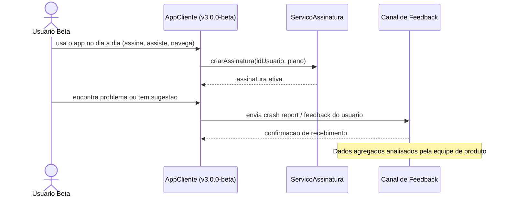

### Explicação Textual Correlacionada ao Diagrama

O diagrama mostra o `Usuario Beta` interagindo organicamente com o `AppCliente` — sem roteiro fixo — enquanto o fluxo técnico real (`ServicoAssinatura`) continua funcionando normalmente em segundo plano. O elemento central que diferencia este cenário é o `Canal de Feedback`, que recebe tanto relatórios automáticos (crash reports) quanto feedback manual do usuário, alimentando a equipe de produto para decisões sobre a versão final.

---

### Por Que Este Cenário Não é User Acceptance Testing

O UAT (seção 3.1) é conduzido de forma estruturada, com critérios de aceitação formais e pré-definidos junto ao cliente/stakeholder de negócio, validando requisitos específicos e contratados. O Teste Beta, por outro lado, é exploratório e orgânico: os usuários reais usam o sistema livremente, sem um roteiro de critérios de aprovação/reprovação fixos, e o objetivo é capturar problemas e percepções que só emergem do uso real em escala e diversidade — não validar se um requisito contratual específico foi atendido.

### Comparação Final: Teste Alfa vs. Teste Beta

| Aspecto | Teste Alfa | Teste Beta |
|---|---|---|
| Quem participa | Equipe interna da organização | Usuários externos reais, representativos do público-alvo |
| Ambiente | Staging interno, controlado, via VPN corporativa | Produção ou réplica de produção, acesso público real |
| Visibilidade | Não pública | Semi-pública (grupo seleto, mas externo) |
| Roteiro de uso | Fluxos definidos pela equipe de QA/produto | Uso livre e orgânico, sem roteiro fixo |
| Foco da coleta | Usabilidade interna e bugs antes de qualquer exposição externa | Comportamento em escala real, diversidade de dispositivos/rede, satisfação do usuário final |
| Momento no ciclo | Antes do Beta | Última etapa antes do lançamento público |

---

## 4.1 — Teste de Recuperação (Recovery Testing)

### Contexto

Durante o processamento de uma assinatura, o `GatewayPagamentoExterno` sofre uma queda temporária (indisponibilidade do serviço externo de pagamento), simulando uma falha real que pode ocorrer em produção. O objetivo é verificar se o StreamPlay se recupera adequadamente dessa falha, sem perda de dados nem travamento definitivo para o usuário.

### Falha Provocada

Indisponibilidade momentânea do `GatewayPagamentoExterno` (timeout de conexão / erro 503), injetada deliberadamente durante a chamada `cobrar(dadosCartao, valor)`.

### Mecanismo de Recuperação

O `ServicoAssinatura` implementa uma política de retry com backoff: tenta novamente a chamada ao `GatewayPagamentoExterno` até 3 vezes, com intervalo crescente entre tentativas. Se todas as tentativas falharem, o sistema marca a assinatura como `"pendente"` no `RepositorioUsuarios` (em vez de perder a solicitação) e agenda uma nova tentativa automática posterior, notificando o usuário de forma clara.

### Diagrama de Sequência (Mermaid)

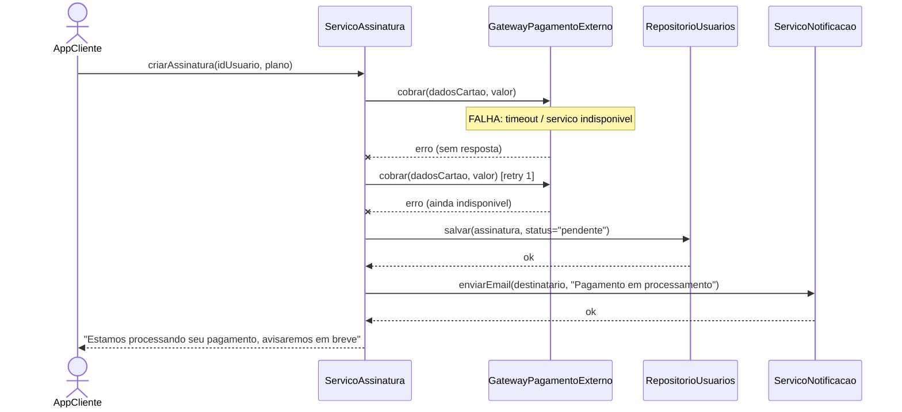

### Explicação Textual Correlacionada ao Diagrama

O diagrama evidencia claramente os oito elementos solicitados: o `Cliente` (AppCliente) inicia a operação; o `Sistema` (ServicoAssinatura) orquestra o fluxo; o `Gateway` é o componente que falha (marcado com nota explícita de falha); o evento de falha é representado pela seta tracejada com "x" (`--x`); o mecanismo de recuperação é a tentativa de retry seguida da persistência do estado `"pendente"` no `Repo`; o recurso alternativo é justamente não perder a solicitação, guardando-a como pendente; a retomada da operação ocorre quando o `Gateway` volta a responder e o retry automático posterior é bem-sucedido; e a resposta ao cliente aparece em dois momentos — a mensagem imediata de "processando" e, futuramente, a confirmação final.

---

### Objetivo

Verificar se o sistema consegue se recuperar de uma falha grave em um componente externo crítico sem perder a solicitação do usuário nem deixá-lo sem retorno algum, mantendo a integridade dos dados durante e após a falha.

### Comportamento Esperado

- O sistema não deve travar nem retornar erro genérico sem explicação ao usuário.
- A tentativa de pagamento não deve ser perdida — deve ficar registrada como `"pendente"`.
- O usuário deve ser informado do estado transitório de forma clara.
- Quando o `GatewayPagamentoExterno` voltar a responder, a cobrança deve ser retomada automaticamente, sem exigir nova ação manual do usuário.

### Tempo ou Condição de Recuperação

Até 3 tentativas de retry com backoff exponencial (ex: 2s, 4s, 8s) durante a solicitação inicial; caso todas falhem, uma nova tentativa automática ocorre em até 15 minutos, ou quando um monitoramento de disponibilidade do `GatewayPagamentoExterno` detectar que o serviço voltou.

### Possíveis Perdas de Dados

Idealmente, nenhuma — a assinatura fica registrada como `"pendente"` no `RepositorioUsuarios` antes de qualquer confirmação de pagamento, garantindo que a intenção do usuário não seja perdida mesmo que o processo de cobrança falhe totalmente.

### Critério de Aprovação

O teste é aprovado se, após a falha simulada e a posterior recuperação do `GatewayPagamentoExterno`, a assinatura do usuário for corretamente ativada sem duplicidade de cobrança, sem perda do registro da tentativa original, e com notificação adequada ao usuário em cada etapa relevante.

---

### Diferença Entre Recovery Testing, Performance Testing e Stress Testing

| Aspecto | Recovery Testing | Performance Testing | Stress Testing |
|---|---|---|---|
| Objetivo | Verificar recuperação após falha | Medir tempo de resposta/throughput em condições normais/esperadas | Verificar comportamento no limite ou além da capacidade do sistema |
| O que é provocado | Uma falha explícita (queda de componente, indisponibilidade) | Carga controlada dentro da capacidade esperada | Carga acima da capacidade normal, até o ponto de ruptura |
| Pergunta respondida | "O sistema volta a funcionar corretamente após falhar?" | "O sistema responde rápido o suficiente sob uso normal/esperado?" | "O que acontece quando o sistema é levado além do limite?" |
| Métrica principal | Integridade dos dados e sucesso da recuperação | Tempo de resposta, throughput | Ponto de saturação, degradação, tipo de falha sob sobrecarga |

---

## 4.2 — Teste de Segurança

### Cenário: Tentativa de Acesso a Dados de Outro Usuário (Broken Object-Level Authorization)

### 1. Ameaça ou Condição de Segurança

Um usuário autenticado tenta acessar os dados de assinatura de outro usuário, manipulando o identificador enviado na requisição (ex: trocando o `idUsuario` no corpo da requisição para o ID de outra conta), buscando visualizar informações às quais não deveria ter acesso.

### 2. Ativo Protegido

Dados pessoais e de assinatura do usuário, armazenados via `RepositorioUsuarios` (ex: histórico de pagamento, plano contratado, dados de perfil).

### 3. Ator

Usuário autenticado e legítimo do sistema (possui uma conta válida e um token JWT válido), mas com intenção de acessar dados fora do seu próprio escopo de permissão.

### 4. Ponto de Entrada

Endpoint de consulta de assinatura via `APIGateway`, especificamente a operação que recupera os dados de assinatura de um usuário (rota que aceita `idUsuario` como parâmetro).

### 5. Mecanismo de Proteção

O `APIGateway` valida o token JWT (via `ServicoAutenticacao`) e, além disso, o `ServicoAssinatura` verifica se o `idUsuario` extraído do token autenticado corresponde ao `idUsuario` solicitado na requisição — rejeitando a operação caso sejam diferentes, independentemente do token ser válido.

### 6. Resultado Esperado

O sistema deve retornar erro de autorização (HTTP 403 — Forbidden) e não expor nenhum dado do outro usuário, mesmo que o token do solicitante seja válido.

### 7. Defeito que Seria Revelado

Se o sistema validar apenas a autenticidade do token (usuário está logado), mas não verificar se o `idUsuario` do token corresponde ao `idUsuario` da requisição, ele exporia indevidamente dados de terceiros — uma falha clássica de autorização em nível de objeto (Broken Object-Level Authorization).

### Diagrama de Sequência (Mermaid)

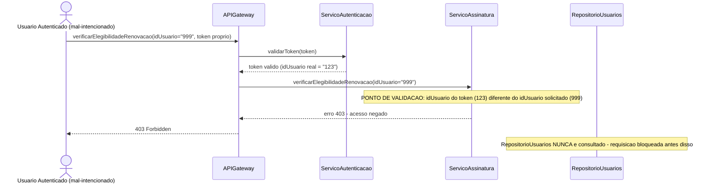

### Explicação Textual Correlacionada ao Diagrama

O ponto crítico do diagrama está destacado na nota sobre `ServicoAssinatura`: é ali que ocorre a validação de autorização em nível de objeto, comparando o `idUsuario` extraído do token autenticado (`123`) com o `idUsuario` solicitado na requisição (`999`). Como esses valores divergem, a requisição é bloqueada antes de qualquer consulta ao `RepositorioUsuarios` — o que é explicitamente indicado na segunda nota do diagrama, reforçando que o ativo protegido (dados armazenados) nunca chega a ser exposto.

### Por Que Este Teste Pertence a System Testing

Este teste pertence ao nível de System Testing porque avalia o comportamento de segurança do sistema como um todo, integrado e funcionando de ponta a ponta — envolvendo a colaboração real entre `APIGateway`, `ServicoAutenticacao` e `ServicoAssinatura` sob uma condição de ataque simulada. Diferente do Teste de Unidade (que verificaria isoladamente se um método de comparação de IDs retorna `true`/`false` corretamente) ou do Teste de Integração (que verificaria apenas se os componentes trocam dados no formato esperado), o Teste de Segurança aqui avalia uma propriedade emergente do sistema completo: se a política de autorização é respeitada de ponta a ponta, considerando o fluxo real de uma requisição maliciosa passando por múltiplas camadas — o que só pode ser observado com o sistema integrado e em execução.

---

## 4.3 — Teste de Estresse (Stress Testing)

### Contexto

O `ServicoStreaming`, integrado à `CDN`, é submetido a um teste de estresse simulando um evento de lançamento simultâneo de um título muito popular no catálogo, quando um número anormalmente alto de usuários tenta assistir ao mesmo conteúdo ao mesmo tempo.

**Observação:** todos os valores numéricos a seguir são parâmetros hipotéticos, definidos apenas para fins didáticos deste estudo de caso, sem relação com capacidade real de qualquer sistema de streaming.

### Carga Nominal

200 requisições simultâneas de reprodução (`autorizarReproducao`) por segundo — valor hipotético considerado a operação normal do sistema em dia comum.

### Carga Crescente

A carga é aumentada progressivamente em degraus hipotéticos: 200 → 500 → 1.000 → 2.000 → 5.000 requisições simultâneas por segundo, mantendo cada patamar por um intervalo fixo (ex: 5 minutos hipotéticos) antes de subir ao próximo.

### Ponto de Saturação

Definido hipoteticamente como o patamar em que o tempo de resposta do `ServicoStreaming` ultrapassa 5 segundos ou a taxa de erros excede 10% das requisições — neste cenário hipotético, ocorre por volta de 3.000 requisições simultâneas.

### Comportamento Esperado Durante Sobrecarga

O sistema não deve travar completamente nem retornar erros sem explicação. Espera-se degradação controlada: aumento gradual do tempo de resposta, possível enfileiramento de requisições, e eventualmente respostas de erro específicas (ex: "sistema sobrecarregado, tente novamente") em vez de timeout silencioso ou queda total do serviço.

### Indicadores Monitorados

- Tempo de resposta médio e máximo de `autorizarReproducao`.
- Taxa de erros (respostas 5xx).
- Uso de CPU e memória do `ServicoStreaming`.
- Taxa de acerto/erro da `CDN` na entrega de segmentos de vídeo.

### Possível Degradação

Aumento progressivo de latência, seguido de aumento da taxa de erros, e em patamares hipotéticos extremos (acima de 5.000 requisições simultâneas), possível indisponibilidade total do `ServicoStreaming` até que a carga seja reduzida.

### Critério de Recuperação ou Encerramento do Teste

O teste é encerrado quando a taxa de erros ultrapassa 50% das requisições ou quando o sistema para de responder por mais de 1 minuto hipotético — nesse ponto, a carga é removida e observa-se se o sistema volta a operar normalmente dentro de um tempo aceitável (critério de recuperação, relacionado à seção 4.1).

### Diagrama (Mermaid)

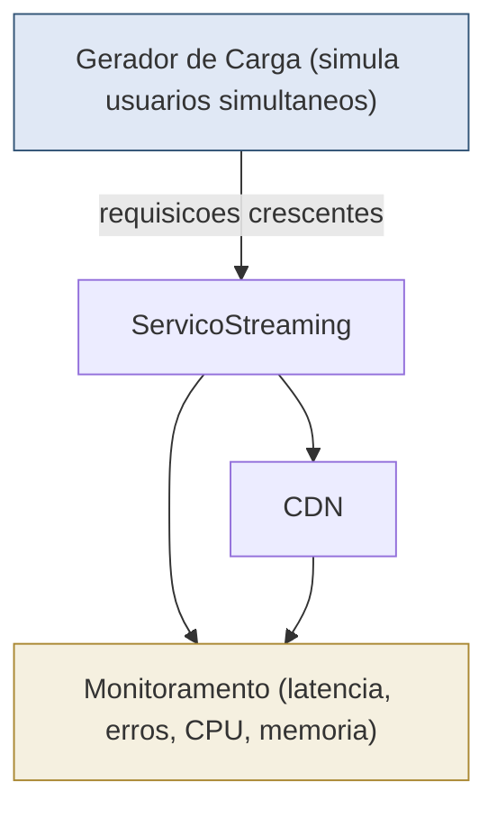

### Diferença Entre Stress Testing e Performance Testing

- **Stress Testing** busca encontrar o ponto de ruptura do sistema, aumentando a carga deliberadamente além da capacidade esperada, para observar como e quando o sistema falha e se ele se recupera.
- **Performance Testing** (seção 4.4) mede o comportamento do sistema sob uma carga representativa e esperada, dentro dos limites normais de operação, para verificar se as metas de tempo de resposta e throughput são atendidas em condições realistas — não busca "quebrar" o sistema.

---

## 4.4 — Teste de Desempenho (Performance Testing)

### Contexto

O `ServicoStreaming` e o `ServicoAssinatura` são avaliados sob uma carga considerada representativa do uso real esperado do StreamPlay em um dia comum, para verificar se o sistema atende às metas de desempenho definidas para este estudo de caso.

**Observação:** as metas numéricas abaixo são critérios hipotéticos, estabelecidos exclusivamente para fins didáticos deste laboratório.

### Métricas Avaliadas e Metas Hipotéticas

| Métrica | Meta hipotética |
|---|---|
| Tempo de resposta (`autorizarReproducao`) | ≤ 800 ms (percentil 95) |
| Throughput | ≥ 300 requisições/segundo sustentadas |
| Taxa de erros | ≤ 1% das requisições |
| Utilização de CPU (`ServicoStreaming`) | ≤ 70% sob carga nominal |
| Utilização de memória (`ServicoStreaming`) | ≤ 75% da capacidade alocada |
| Latência de rede até a `CDN` | ≤ 150 ms |
| Capacidade de processamento (`ServicoAssinatura`) | ≥ 100 assinaturas processadas/minuto |

### Diagrama (Mermaid)

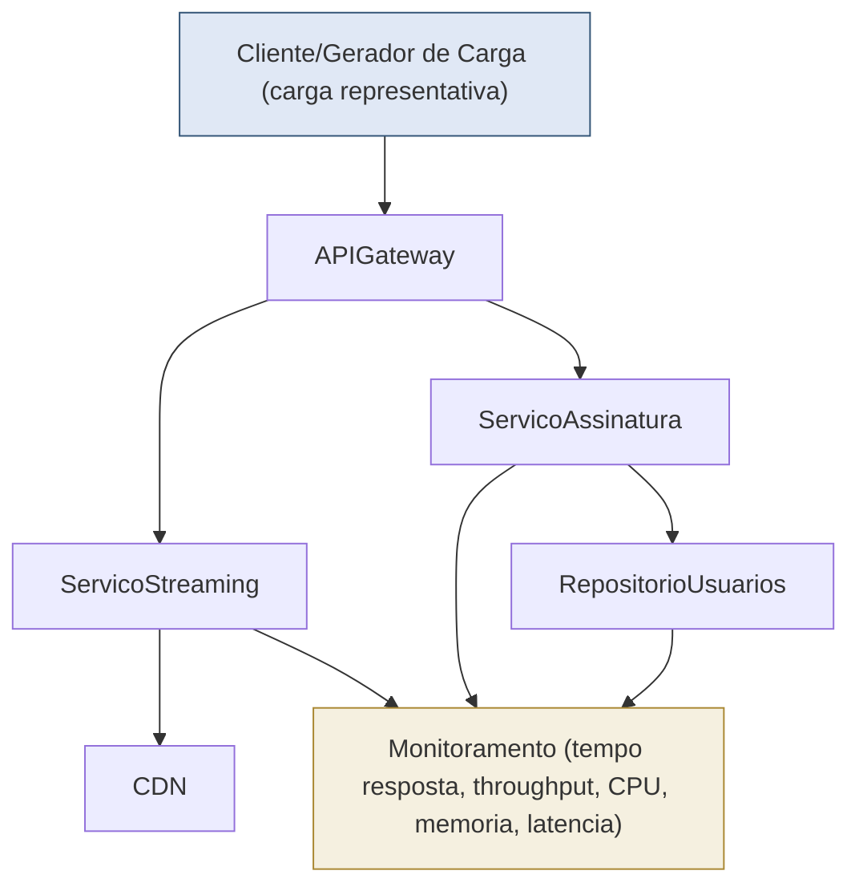

### 1. O que Está Sendo Medido

O tempo de resposta das operações críticas (`autorizarReproducao`, `criarAssinatura`), o throughput sustentado do sistema, a taxa de erros sob carga normal, e o consumo de recursos (CPU, memória) dos componentes envolvidos, além da latência de rede até a `CDN`.

### 2. Qual Carga Está Sendo Aplicada

Uma carga constante e representativa do uso esperado em horário de pico normal (não um evento excepcional como no Stress Testing) — hipoteticamente, 300 requisições simultâneas de reprodução por segundo, mantida de forma estável durante todo o teste (ex: 30 minutos hipotéticos), sem incrementos progressivos.

### 3. Qual é o Resultado Esperado

Todas as métricas devem se manter dentro das metas hipotéticas definidas na tabela acima durante todo o período do teste, sem degradação perceptível ao longo do tempo.

### 4. Como Determinar Aprovação/Reprovação

O teste é aprovado se todas as métricas permanecerem dentro das metas estabelecidas durante o período de carga sustentada. É reprovado se qualquer métrica ultrapassar seu limite hipotético de forma consistente (não apenas picos isolados momentâneos).

### 5. Quais Gargalos Podem Ser Identificados

- Consultas lentas ao `RepositorioUsuarios` durante criação de assinaturas em volume.
- Latência elevada na comunicação entre `ServicoStreaming` e `CDN`.
- Uso excessivo de CPU no `ServicoStreaming` ao processar múltiplas autorizações simultâneas.
- Possível gargalo na validação de token pelo `ServicoAutenticacao`, caso todas as requisições precisem revalidar o token a cada chamada.

### Diferenciando Performance Testing de Stress Testing

Performance Testing verifica se o sistema atende metas de desempenho definidas sob carga normal e esperada, funcionando como uma verificação de conformidade com requisitos não funcionais. Stress Testing, por sua vez, não tem meta de aprovação baseada em métricas fixas de desempenho normal — seu objetivo é justamente ultrapassar a capacidade esperada para descobrir o ponto de ruptura e o comportamento do sistema em condições extremas, avaliando resiliência e recuperação, não conformidade com metas de uso cotidiano.

---


